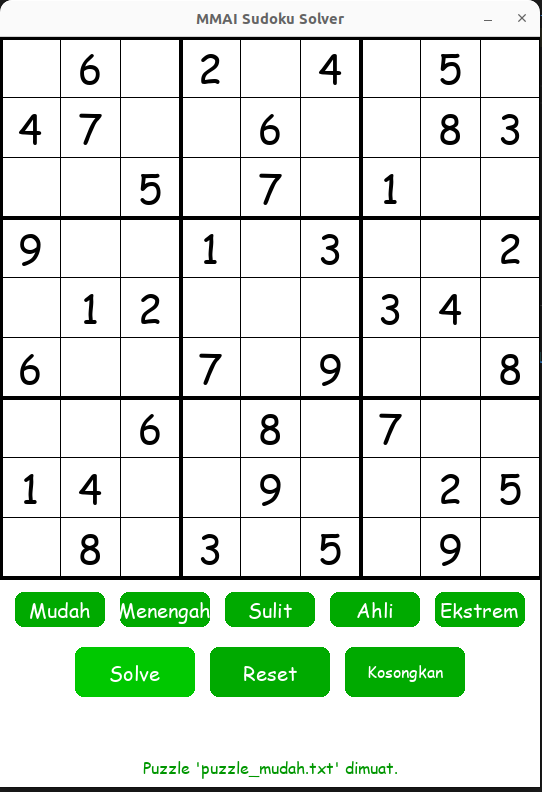

MMAI Sudoku Solver
1. Deskripsi Proyek
MMAI Sudoku Solver adalah sebuah aplikasi desktop yang dikembangkan sebagai bagian dari tugas mata kuliah MMAI1001 - Kecerdasan Artifisial. Program ini dirancang untuk menyelesaikan teka-teki Sudoku 9x9 dari berbagai tingkat kesulitan secara instan.

Aplikasi ini tidak hanya menemukan solusi, tetapi juga menyediakan antarmuka grafis (GUI) yang interaktif bagi pengguna untuk memuat puzzle, memicu proses penyelesaian, dan menganalisis performa algoritma yang digunakan.

2. Fitur Utama
Solver Super Cepat: Mengimplementasikan algoritma Backtracking yang dioptimalkan dengan Heuristik Minimum Remaining Values (MRV) dan representasi data Bitmask, mampu menyelesaikan puzzle tingkat ekstrem dalam hitungan milidetik.

Antarmuka Grafis Interaktif: GUI yang dibangun dengan Pygame memungkinkan pengguna berinteraksi secara visual dengan program.

Berbagai Tingkat Kesulitan: Dilengkapi dengan 5 level puzzle (Mudah, Menengah, Sulit, Ahli, Ekstrem) yang dapat dimuat dengan sekali klik.

Fungsionalitas Reset: Tombol "Reset" memungkinkan pengguna untuk mengembalikan papan ke kondisi awal setelah diselesaikan.

Fungsionalitas Kosongkan: Tombol "Kosongkan" dapat untuk membuat papan ke kondisi kosong tanpa ada nilai 

Time Inference: Menampilkan waktu eksekusi (runtime) yang akurat dalam milidetik untuk setiap proses penyelesaian.

Input & Output File: Membaca puzzle dari file .txt dan menyimpan solusinya ke SolusiSudoku.txt, serta dapat mengisi angka awal langsung di GUI.

3. Algoritma yang Digunakan
Proyek ini menggunakan algoritma Backtracking dengan Heuristik MRV & Bitmask.

Bitmask: Kandidat angka (1-9) yang valid untuk setiap baris, kolom, dan kotak 3x3 direpresentasikan sebagai bitvector (sebuah integer). Ini memungkinkan pengecekan validitas kandidat dilakukan dengan operasi bitwise (|, &, ~) yang sangat cepat, jauh lebih efisien daripada iterasi list atau set.

Minimum Remaining Values (MRV): Daripada mencoba sel kosong secara berurutan, algoritma ini secara cerdas memilih sel yang memiliki jumlah kandidat paling sedikit. Strategi "fail-fast" ini secara drastis memangkas cabang pencarian yang tidak perlu dieksplorasi, menghasilkan peningkatan performa yang masif.

Kombinasi kedua teknik ini menghasilkan solver yang sangat efisien dan mampu bersaing dengan solver Sudoku modern.

4. Struktur Proyek
Pastikan semua file berikut berada dalam satu direktori yang sama:
```bash
.
├── MMAISudokuSolver.py       # File utama program dengan input GUI
├── sudokusolver.py           # File program tanpa input GUI   
├── puzzle_mudah.txt          # Contoh puzzle
├── puzzle_menengah.txt
├── puzzle_sulit.txt
├── puzzle_ahli.txt
├── puzzle_ekstrem.txt
└── requirements.txt          # File dependensi Python
```
5. Panduan Instalasi dan Setup
Untuk menjalankan proyek ini di komputer Anda, ikuti langkah-langkah berikut:

Langkah 1: Prasyarat

Pastikan Python 3.8 atau versi yang lebih baru telah terinstal.

Langkah 2: Dapatkan Kode Proyek

Unduh atau clone repositori ini ke lokal.

Langkah 3: Buat Lingkungan Virtual (Direkomendasikan)

Buka terminal atau command prompt, arahkan ke folder proyek, dan jalankan:
```bash
# Membuat virtual environment
python3 -m venv venv

# Mengaktifkan virtual environment
# Di Windows:
.\venv\Scripts\activate
# Di MacOS/Linux:
source venv/bin/activate
```
Langkah 4: Instal Dependensi

Dengan lingkungan virtual yang aktif, instal library yang diperlukan menggunakan file requirements.txt:
```bash
pip install -r requirements.txt
```
Perintah ini akan secara otomatis menginstal pygame versi 2.6.1.

6. Cara Menjalankan Program
Setelah instalasi selesai, jalankan program utama dari terminal:
```bash
python3 MMAISudokuSolver.py
```
Sebuah jendela aplikasi akan muncul di layar Anda.


7. Cara Menggunakan Aplikasi
Memuat Puzzle: Klik salah satu dari lima tombol tingkat kesulitan di bagian bawah ("Mudah", "Menengah", dst.) untuk memuat puzzle ke papan.

Menyelesaikan Puzzle: Klik tombol "Solve". Algoritma akan berjalan dan solusi akan langsung ditampilkan di papan. Waktu eksekusi akan muncul di pojok kanan bawah.

Mereset Papan: Klik tombol "Reset" untuk mengembalikan papan ke kondisi puzzle awal. Setelah di-reset, Anda dapat menekan "Solve" lagi.